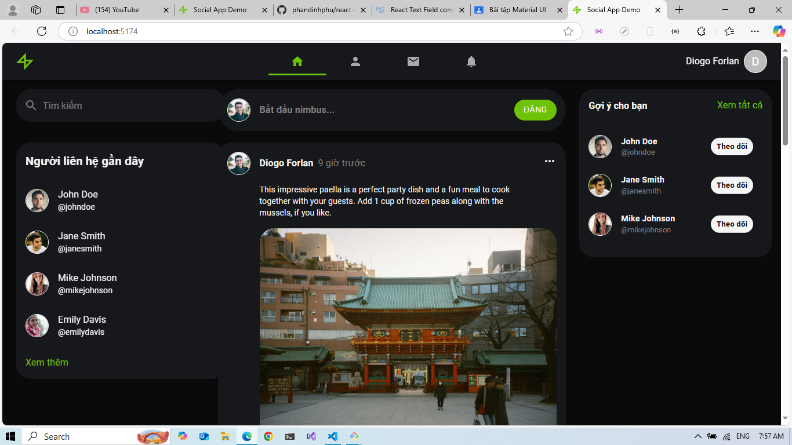
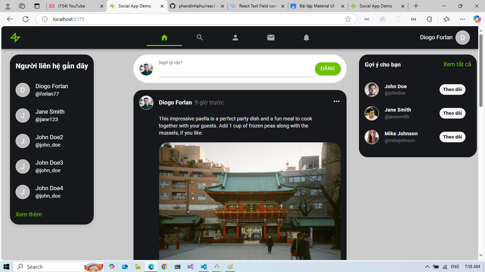
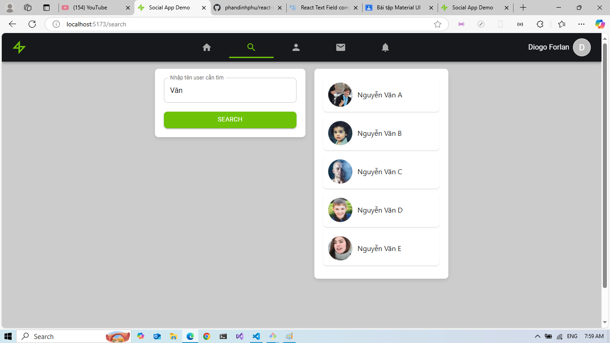
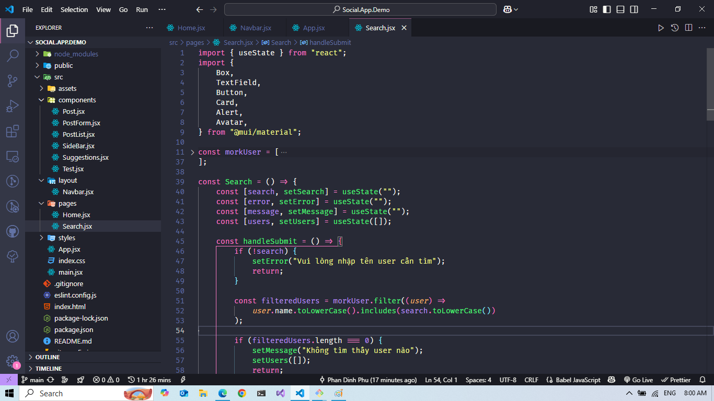

# Cách dùng

```
# Tải dự án về
git clone https://github.com/nhattVim/Social.App.Demo.git
cd Social.App.Demo

# Nếu dùng yarn
yarn
yarn dev

# Nếu dùng npm
npm i
npm run dev
```
# Screenshot

- Giao diện cũ


- Giao diện mới


- Giao diện trang tìm kiếm


- Giao diện IDE
